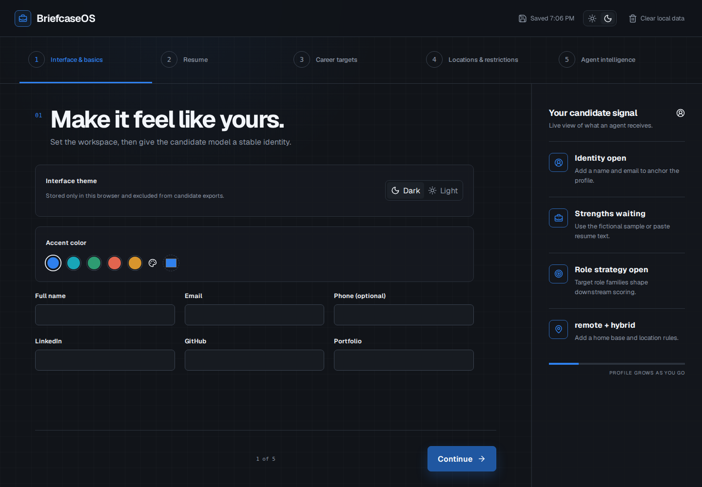
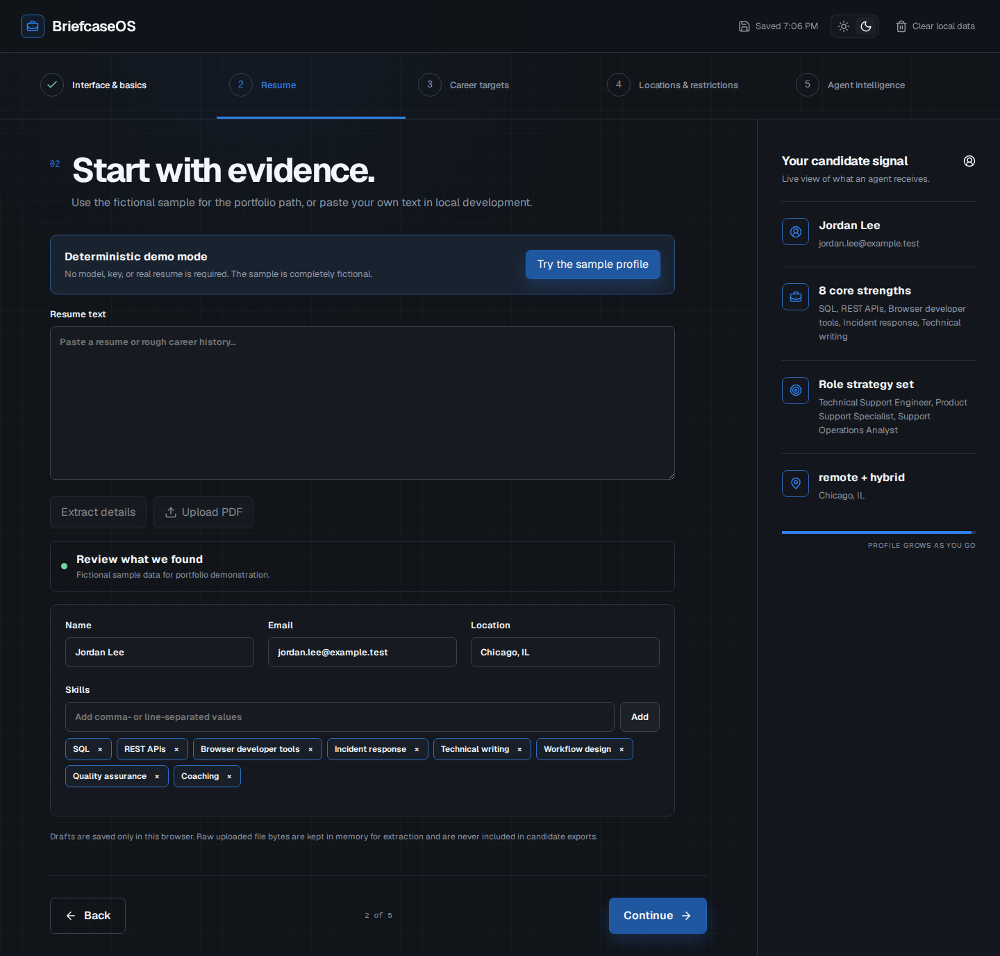
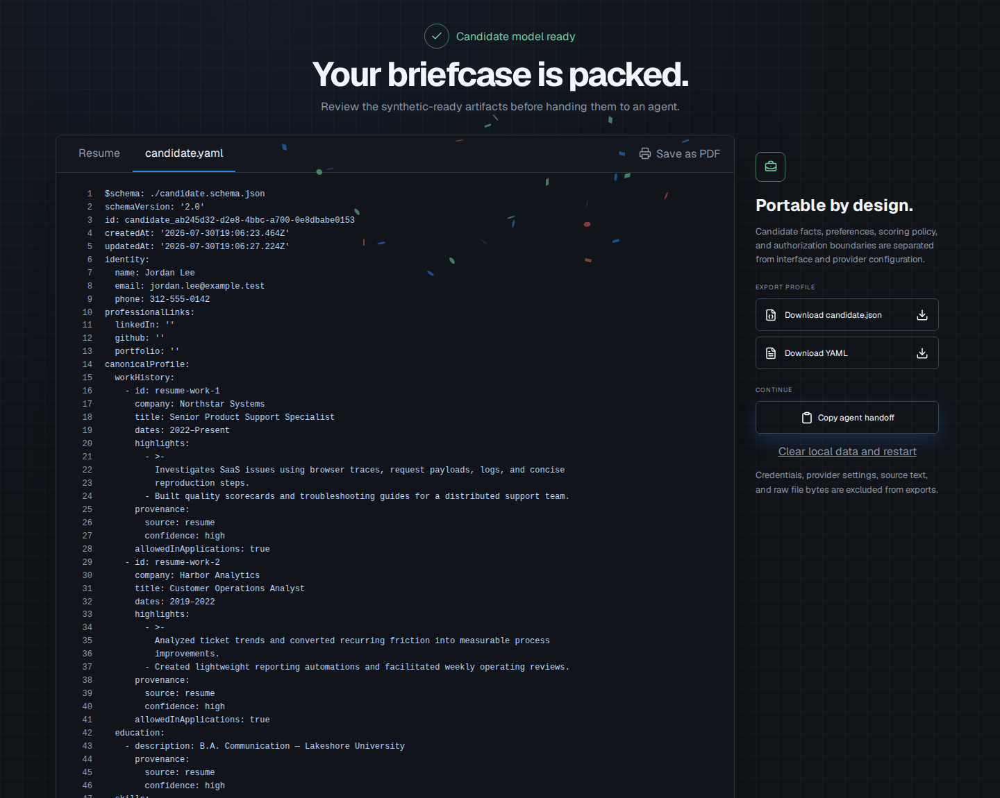
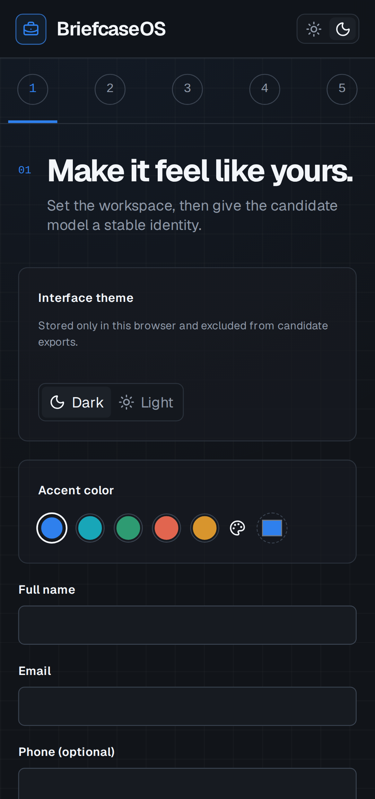

# BriefcaseOS Onboarding

A resume-first candidate intake that converts career evidence, constraints, ranking preferences, and agent guardrails into portable JSON and YAML.

> This public project was rebuilt with fresh history. Private infrastructure, credentials, personal candidate fixtures, and internal deployment material are intentionally excluded.



## The product story

BriefcaseOS Onboarding demonstrates how an AI-assisted job-search workflow can begin with explicit human decisions instead of an unstructured résumé upload. The five-step experience separates candidate facts from preferences, hard constraints, scoring policy, package guidance, and authorization boundaries.

The default portfolio path is deterministic and uses the wholly fictional Jordan Lee profile. It requires no API key, network inference, or real résumé.

| Fictional evidence review | Portable completion workbench |
| --- | --- |
|  |  |

## What it demonstrates

- A polished five-step React and TypeScript onboarding flow.
- A provenance-aware candidate decision model with a strict public schema.
- Hard filters separated from weighted ranking preferences.
- Candidate-controlled authorization boundaries for downstream agents.
- Deterministic fictional extraction with no credential or model dependency.
- An optional, isolated Gemini adapter for local or self-hosted evaluation.
- Sanitized `candidate.json` and `candidate.yaml` exports.
- Draft recovery and migration without preserving uploaded file bytes.
- Dark and light themes, configurable accents, responsive layouts, and a document workbench.
- Automated desktop and mobile workflow tests with accessibility scans.

<details>
<summary>Mobile layout</summary>



</details>

## Architecture

```text
Browser UI
  ├─ candidate draft + interface preferences in local storage
  ├─ deterministic fictional demo path
  └─ POST /api/parse-resume
         └─ provider-neutral server interface
              ├─ demo provider (default)
              └─ optional Gemini provider (server environment only)
```

The public baseline uses a generic Node and Express runtime. Provider configuration never enters candidate exports, and the browser never receives an API key.

## Run locally

```bash
npm ci
npm run dev
```

Open `http://localhost:3000`. The default demo provider works immediately.

### Optional live extraction

```bash
cp .env.example .env
# Set EXTRACTION_PROVIDER=gemini and provide your own server-side GEMINI_API_KEY.
npm run dev
```

The key is read only by the Node server. Never prefix it with `VITE_`, place it in browser code, or commit it.

## Verification

```bash
npm run verify       # typecheck, unit tests, production build, public audit
npm run test:e2e     # desktop/mobile journey and accessibility scans
npm run licenses     # regenerate dependency license evidence
```

GitHub Actions additionally uses the committed lockfile, installs Chromium, captures portfolio screenshots, checks responsive overflow and console errors, and uploads release evidence. The latest release audit covered 170 installed packages with zero unknown licenses.

## Privacy boundaries

- The public portfolio journey uses fictional data.
- Candidate drafts stay in browser storage.
- Uploaded file bytes exist only in memory during extraction and are never exported.
- **Clear local data** removes candidate drafts while retaining only theme and accent preferences.
- Live extraction is optional, server-side, and requires explicit user consent.
- The project has no user database and does not retrieve jobs, contact people, or submit applications.

## Documentation

- [Architecture](docs/architecture.md)
- [Privacy model](docs/privacy.md)
- [Clean-room provenance](docs/clean-room-note.md)
- [Release evidence](docs/release-evidence.md)
- [Dependency licenses](docs/dependency-licenses.md)
- [Security policy](SECURITY.md)

## License

Released under the [MIT License](LICENSE).
