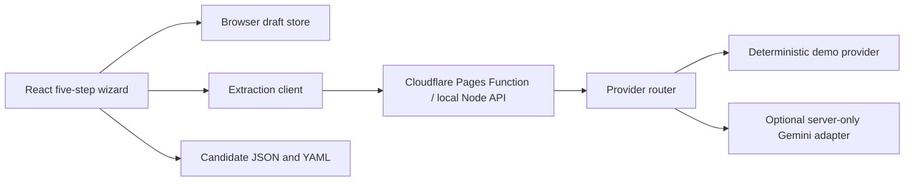

# Architecture

BriefcaseOS Onboarding is organized around a provider-neutral candidate domain.

## Boundaries

- The hosted portfolio path uses the deterministic provider and requires no secret.
- Production is deployed at `https://briefcase.devthomas.site` as Vite static assets plus Pages Functions.
- Candidate exports contain candidate facts, preferences, scoring policy, and authorization boundaries.
- Provider selection, API keys, model names, endpoints, interface preferences, raw source text, and uploaded bytes are excluded from candidate exports.
- The live adapter is server-only and enabled through deployment environment variables and an encrypted secret.
- The Cloudflare adapter is intentionally thin; provider selection and validation remain shared with the local Node adapter.
